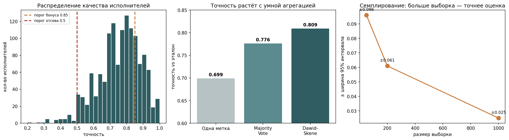

# crowdsourcing-quality-control
# Контроль качества краудсорсинга

Один исполнитель угадывает правильный ответ в 70% случаев. Каждый третий ответ — увы, оказывается, мимо. На этом и держится весь проект: доверие к людям необходимо подкреплять измерением качества.

Разбираю это на `relevance-2` — открытом датасете [Toloka](https://github.com/Toloka/crowd-kit) (краудсорсинговое подразделение Яндекса). Исполнители бинарно оценивают релевантность пар «запрос — объект»: подходит / нет. ~475 тыс. меток, 7138 исполнителей, 99 319 задач и экспертный эталон по 10 079 из них.



## Как я это раскручивала

**Базовая точка.** Сначала я приклеила эталон к каждой метке и посчитала, как часто вообще одиночный ответ совпадает с истиной — **0.699**, вся дальнейшая логика отсчитывается отсюда.

**Кто эти исполнители?** Точность по каждому, кто сделал хотя бы 10 задач (по двум-трём оценивать — это шум, а не статистика), и получается довольно честный разброс: от **0.20** — хуже подбрасывания монетки — до идеальной **1.0**. 

**Агрегация вытягивает качество.** Собрала по каждой задаче голоса нескольких исполнителей и сравнила два метода:

| Подход | Точность к эталону |
|---|---|
| Одиночная метка | 0.699 |
| Majority Vote | 0.776 |
| Dawid–Skene | **0.809** |

Получилось так, что Dawid–Skene выигрывает (в целом, это было скорее очевидно, чем нет), потому что не считает все голоса равными — он взвешивает их по надёжности исполнителя. Итог: примерно **треть ошибок** одиночной метки срезается, и почти без затрат, одной агрегацией.

**Семплирование вместо тотальной проверки.** Проверять 99 тысяч задач руками — ресурсы на ветер. Поэтому оцениваю качество потока по случайной выборке с доверительным интервалом. На выборке в **1000 задач (1% от всего)** оценка попадает в истину с точностью около **±2.5%**. Чем больше выборка — тем уже интервал, и масштаб выборки влияет на ширину сильнее всего.

**Бонусы, обучение, отсеивание.** Дальше я свела всё в управленческое правило: стабильно точным (≥0.85 и хотя бы 10 задач) — бонус, с показателем «хуже монетки» (<0.5) — из потока, остальным — на обучение.

| Статус | Исполнителей | Что делаем |
|---|---|---|
| Бонус | 325 (средняя точность 0.91) | платим |
| На обучение | 967 | растим |
| Из потока | 35 | убираем |

## Пара комментариев

Пороги 0.85 и 0.5 я задала вручную — на реальном проекте их, естественно, подбирают под бюджет и нужное качество, это уже совсем другая история. И часть задач в датасете размечена маленьким числом исполнителей, поэтому реальный разрыв между одиночной меткой и агрегацией на полноценных задачах ещё больше.

## Стек

Python · pandas · numpy · crowd-kit · scikit-learn · matplotlib

## Запуск

```bash
pip install crowd-kit pandas matplotlib
```
Открыть `crowdsourcing_quality.ipynb` и прогнать ячейки сверху вниз. Данные подтянутся сами.
